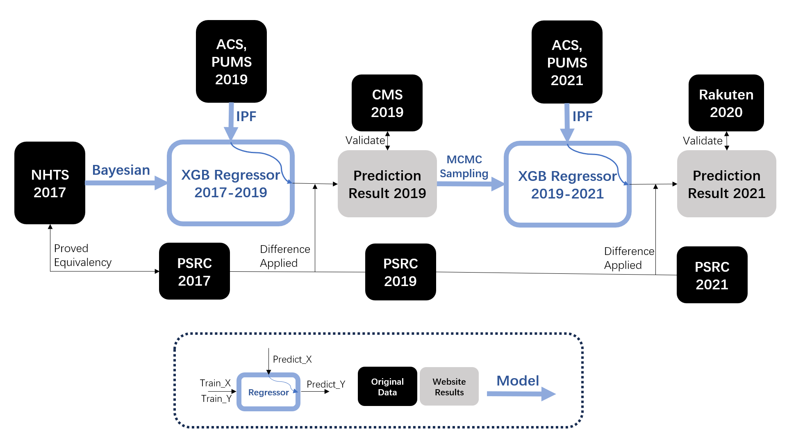

# Basic Framework of our Research

## Part 0: Validation of the Equivalency between NHTS and PSRC 2017

### Data Collection
nhts2017 = load_dataset("NHTS2017")
psrc2017 = load_dataset("PSRC2017")

### Calculate Average Delivery Values for Different Kinds of Individuals
nhts_delivery_avg = calculate_average_delivery_96Categories(nhts2017)
psrc_delivery_avg = calculate_average_delivery_96Categories(psrc2017)

### Rank the Delivery Values Separately
nhts_rank = rank_delivery_values(nhts_delivery_avg)
psrc_rank = rank_delivery_values(psrc_delivery_avg)

### Calculate MSE between NHTS and PSRC Rank Sets
mse = calculate_mse(nhts_rank, psrc_rank)

### Generate Random Rank Sets and Calculate MSE
random_mse_list = []
for _ in range(10000):
    random_rank = generate_random_rank(nhts_rank)  # Generate a random rank set
    random_mse = calculate_mse(nhts_rank, random_rank)
    random_mse_list.append(random_mse)

### Check if MSE is within the lower 5% of random MSE values
lower_5_percent_mse = np.percentile(random_mse_list, 5)
if mse <= lower_5_percent_mse:
    equivalency_validated = True
else:
    equivalency_validated = False

## End of Part 0
## Part 1: Data Processing and Model Training/Evaluating for 2017-2019

### Data Collection
nhts2017 = load_dataset("NHTS2017")
acs2019 = load_dataset("ACS/PUMS2019")
psrc2017 = load_dataset("PSRC2017")
psrc2019 = load_dataset("PSRC2019")
cms2019 = load_dataset("CMS2019")

### Bayesian Data Modification for NHTS2017
x_train2017, y_train2017 = bayesian_data_modification(nhts2017)

### Iterative Proportional Fitting for ACS/PUMS2019
population2019 = iterative_proportional_fitting(acs2019)

### Train XGBRegressor2017-2019
model_2017_2019 = train_xgb_regressor(x_train2017, y_train2017)

### Evaluation using XGBRegressor2017-2019
raw_result2017_2019 = evaluate_with_xgb(model_2017_2019, population2019)

### Generate result2019
result2019 = raw_result2017_2019 + (psrc2019 - psrc2017)

### Validation with CMS2019
validation_result2019 = validate_with_cms(result2019)

## End of Part 1

## Part 2: Data Processing and Model Training/Evaluating for 2019-2021

### Data Collection
result2019 = load_result("result2019")  # Load the result from Part 1
population2019 = load_population("population2019")  # Load the 2019 population

acs2021 = load_dataset("ACS/PUMS2021")
psrc2021 = load_dataset("PSRC2021")
rkt2020 = load_dataset("RKT2020")

### MCMC Sampling
x_train2019, y_train2019 = mcmc_sampling(result2019, population2019)

### Train XGBRegressor2019-2021
model_2019_2021 = train_xgb_regressor(x_train2019, y_train2019)

### Iterative Proportional Fitting for ACS/PUMS2021
population2021 = iterative_proportional_fitting(acs2021)

### Evaluation using XGBRegressor2019-2021
raw_result2019_2021 = evaluate_with_xgb(model_2019_2021, population2021)

### Generate result2021
result2021 = raw_result2019_2021 + (psrc2021 - psrc2019)

### Validation with RKT2020
validation_result2021 = validate_with_rkt(result2021)

## End of Part 2

# Execution flow of our project

In "Script.ipynb", modify the cbsa code list of interest to run the .py script multiple times.